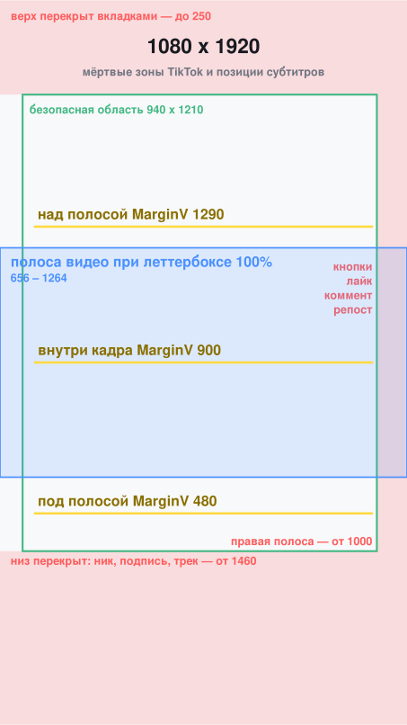
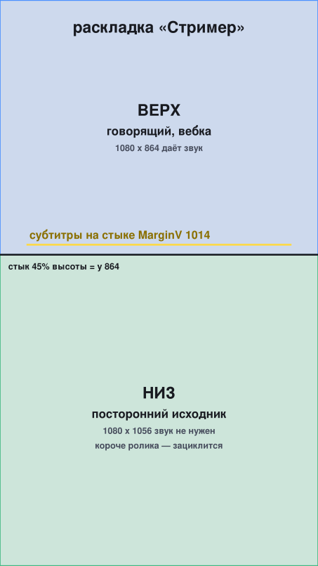
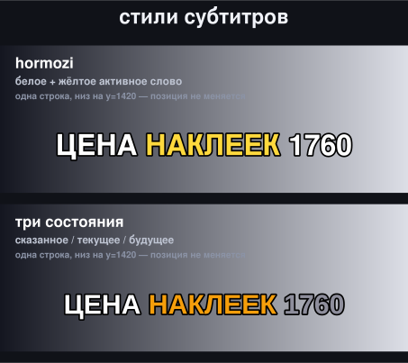

<div align="center">

# TikTok Clip Factory

**Длинное горизонтальное видео → вертикальные ролики под TikTok**

Смысловые резы · караоке-субтитры со словными таймингами · баннер с хромакеем · вырезание чужих интеграций


</div>

---

Всё работает на `ffmpeg` + `libass` + Python. Никаких платных сервисов в цепочке:
распознавание речи локальное, шрифты под открытой лицензией, рендер на ffmpeg.

**Три режима.** `Нарезка` берёт из ролика сильнейшие куски. `Фулл` разбирает его
целиком на последовательные части. `Стример` собирает двойную раскладку: сверху
говорящий, снизу посторонний исходник.

<table>
<tr>
<td width="33%" align="center"><br><sub><b>Мёртвые зоны TikTok</b><br>и позиции субтитров</sub></td>
<td width="33%" align="center"><br><sub><b>Раскладка «Стример»</b><br>стык на 45% высоты</sub></td>
<td width="33%" align="center"><br><sub><b>Четыре стиля</b><br>на светлом и тёмном фоне</sub></td>
</tr>
</table>

---

## Содержание

**Начало**

- [Как это устроено](#как-это-устроено) — схема конвейера
- [Установка](#установка)
- [Три режима работы](#три-режима-работы) · [нарезка](#нарезка-highlights) · [фулл](#фулл-последовательный) · [стример](#стример-двойная-раскладка)

**Модули и команды**

| Модуль | За что отвечает |
|---|---|
| [`story.py`](#storypy--смысловая-структура) | смысловая структура: где резать, не сломав мысль |
| [`full_mode.py`](#full_modepy--режим-фулл) | последовательные части с вырезанием рекламы |
| [`plan.py`](#planpy--точки-реза-по-звуку) | точки реза по паузам и сменам сцен |
| [`captions.py`](#captionspy--караоке-субтитры) | караоке-субтитры → [**за что отвечает каждый стиль**](#за-что-отвечает-каждый-стиль) |
| [`chunking.py`](#chunkingpy--разбивка-на-строки) | группировка слов в строки по смыслу |
| [`glossary.py`](#glossarypy--словарь-ниши) | словарь терминов ниши и ослышек |
| [`reframe.py`](#reframepy--кадр-с-ведением-субъекта) | кадр с ведением субъекта |
| [`variants.py`](#variantspy--статичный-кадр-и-сравнение-стилей) | статичный кадр, сравнение стилей |
| [`detect.py`](#detectpy--тип-материала-по-картинке) | есть ли в кадре говорящий |
| [`pause.py`](#pausepy--остановка-видео-под-баннер) | остановка видео под баннер |
| [`streamer.py`](#streamerpy--двойная-раскладка) | двойная раскладка → [порядок с паузой](#полный-порядок-для-категории-стример-с-паузой) |
| [`banner.py`](#bannerpy--баннер-с-хромакеем) | хромакей, деспилл, сведение звука |
| [`rhythm.py`](#rhythmpy--финальная-сборка) | финальная сборка |
| [`build.py`](#buildpy--автоматический-конвейер) | всё одной командой |

**Справочное**

- [Зафиксированные параметры](#зафиксированные-параметры) — [видео](#видео) · [субтитры](#субтитры) · [звук](#звук) · [безопасные зоны](#безопасные-зоны-tiktok-на-1080x1920)
- [Что проверено, а что нет](#что-проверено-а-что-нет) — честный статус каждого модуля
- [Известные ограничения](#известные-ограничения)
- [Грабли, на которые уже наступили](#грабли-на-которые-уже-наступили) — чтобы не повторять
- [Лицензия](#лицензия)

---

## Как это устроено

```
исходник (16:9)
      │
      ├─► detect.py ──────► есть ли в кадре говорящий: от этого зависит раскладка
      │
      ├─► pause.py ───────► вставка остановки видео под баннер (до транскрипции!)
      │
      ├─► story.py ───────► смысловая структура: где мысль открывается и закрывается,
      │                     где реклама автора, где служебная концовка
      │
      ├─► full_mode.py ───► план частей для режима «фулл» (реклама вырезана,
      │                     стыки посажены на её границы)
      │
      ├─► plan.py ────────► точки реза по паузам и сменам сцен (адаптивный порог)
      │
      ├─► faster-whisper ─► тайминги каждого слова (+ словарь терминов ниши)
      │        │
      │        └─► chunking.py ─► группировка слов в строки по смыслу
      │                 │
      │                 └─► captions.py ─► .ass с караоке-подсветкой
      │
      ├─► reframe.py / variants.py ─► позиция вертикального кадра
      │
      ├─► banner.py ──────► хромакей + деспилл + сведение звука
      │
      ├─► rhythm.py ──────► финальная сборка: кадр + субтитры + баннер + громкость
      │
      └─► streamer.py ────► двойная раскладка: сверху говорящий, снизу исходник
                            (при паузе порядок: склеить -> пауза -> баннер и текст)
```

---

## Установка

Нужны `ffmpeg` с `libass` и Python 3.9+.

```bash
# проверить, что libass есть — без него субтитры не наложатся
ffmpeg -hide_banner -filters | grep -E "^ . subtitles"

pip install -r requirements.txt
bash scripts/fetch_fonts.sh
```

**Важно про `drawtext`.** В статических сборках ffmpeg его часто нет. Весь текст
здесь идёт через `libass`, поэтому отсутствие `drawtext` ничего не ломает — но
проверьте, что `subtitles` в списке фильтров есть.

---

## Три режима работы

### Нарезка (highlights)

Из всего ролика выбираются сильнейшие самостоятельные куски. Остальное не идёт
в дело. Годится, когда исходник длинный и неравномерный.

```bash
python3 clipfactory/story.py --transcript t.json --total 445
# дефолт: цель 60 с, диапазон 52-68. Расширять только по необходимости:
python3 clipfactory/story.py --transcript t.json --total 445 --max 90
```

Выдаёт список кандидатов с оценкой качества выхода. Дальше каждый кусок режется
и собирается по отдельности.

**Дефолт — ровно минута.** Целевая длина 60 с, допустимый диапазон 52–68 с:
на выходе несколько роликов примерно по минуте, каждый с сильным моментом.

У жёсткой минуты есть измеренная цена. На тестовом ролике при диапазоне 52–68
три части из семи получают пометку `обрывает развязку` — мысль не успевает
закрыться внутри диапазона. При `--max 90` все закрываются чисто, но части
выходят длиннее минуты. `full_mode.py` печатает это предупреждение сам, с
подсказкой, каким числом лечится — решение остаётся за оператором.

### Фулл (последовательный)

Ролик разбирается целиком с первой секунды на части по минуте — семиминутное
видео становится шестью-семью частями для последовательной заливки.

```bash
python3 clipfactory/full_mode.py --transcript t.json --total 445 --target 60
```

Рекламные вставки автора вырезаются, и их границы становятся границами частей —
поэтому внутри части не возникает склейки, а стык читается как продолжение.

### Стример (двойная раскладка)

Сверху говорящий, снизу посторонний исходник, текст на стыке. Нужны **два**
видео: верхнее даёт звук, нижнее только картинку.

```bash
python3 clipfactory/streamer.py --top webcam.mp4 --bottom gameplay.mp4 \
  --out out.mp4 --dur 45 --auto-focus --draft
```

Подробнее: [`streamer.py`](#streamerpy--двойная-раскладка) и
[порядок с паузой](#полный-порядок-для-категории-стример-с-паузой).

---

## Модули и команды

### `story.py` — смысловая структура

Главный модуль. Отвечает на вопрос «где можно резать, не сломав мысль».

| Что делает | Как |
|---|---|
| Делит текст на предложения с временем | по знакам конца фразы, время из транскрипта |
| Находит открывашки блоков | «на пятом месте», «по итогу», «и наконец», «теперь перейдём» |
| Следит, закрыт ли блок | блок закрыт, когда после открывашки прозвучала конкретика: цифра, цена, вывод |
| Находит рекламу автора | сильные признаки (промокод, спонсор, регистрация) + слабые (сайт, ссылка, вывод) рядом с сильными |
| Находит служебные концовки | прощания, просьбы о лайках и подписке |
| Считает силу точки реза | конец фразы + длина паузы + конкретика − незакрытый блок − реклама − прощание |

```bash
# лучшие куски по всему ролику
python3 clipfactory/story.py --transcript t.json --total 445 --target 60

# проверить один конкретный вход
python3 clipfactory/story.py --transcript t.json --total 445 --at 308.9 --target 60

# машинный вывод
python3 clipfactory/story.py --transcript t.json --total 445 --json
```

Ключевые константы: `SPONSOR_GAP = 10.0` (допустимый провал без признаков внутри
рекламного блока), `SPONSOR_MAX_SPAN = 90.0` (предохранитель роста блока).

### `full_mode.py` — режим фулл

```bash
python3 clipfactory/full_mode.py --transcript t.json --total 445 [--json]
# дефолт: цель 60 с, диапазон 52-68
python3 clipfactory/full_mode.py --transcript t.json --total 445 --max 90
```

Логика стыков:

1. Рекламные интервалы становятся жёсткими границами частей.
2. Внутри чистых участков идёт деление по целевой длине с посадкой на закрытие.
3. **Хвост участка подрезается**, если автор открыл тему и реклама его перебила —
   иначе часть обрывается на полуслове.
4. Участок короче минимума приклеивается к соседнему, и это помечается как
   `склейка через рекламу`.

### `plan.py` — точки реза по звуку

Работает там, где смысловой разбор не нужен: ищет паузы и смены сцен.

```bash
python3 clipfactory/plan.py source.mp4 --parts 3
python3 clipfactory/plan.py source.mp4 --target 60 --tolerance 12
```

**Адаптивный порог тишины.** Фиксированные −32 дБ не работают на материале с
музыкальной подложкой: детектор возвращает ноль интервалов, и резы падают на
жёсткий хронометраж. Порог считается лестницей от среднего уровня дорожки, пока
не наберётся примерно одна пауза на 25 секунд.

### `captions.py` — караоке-субтитры

```bash
# с реальными таймингами (правильный путь)
python3 clipfactory/captions.py --words words.json --clip-dur 60 \
  --style hormozi --margin-v 480 --font-size 88 --outline 10 \
  --max-words 3 --out cap.ass --report

# запасной путь: эвристика по длине слова, если словных таймингов нет
python3 clipfactory/captions.py --audio clip.wav --segments t.json \
  --clip-start 308.9 --clip-dur 60 --style hormozi --out cap.ass
```

Флаги: `--style` (hormozi, threestate, pill, neon), `--margin-v`, `--font-size`,
`--outline`, `--shadow`, `--max-words`, `--no-fixes`.

#### За что отвечает каждый стиль


Посмотреть из командной строки: `python3 clipfactory/captions.py --styles`

Фон на схеме идёт градиентом от тёмного к светлому — сразу видно, какой стиль
где держится, а какой рассыпается.

| Стиль | Как выглядит | Куда подходит |
|---|---|---|
| **hormozi** | Жирный капс, белое с толстой чёрной обводкой 10 px. Звучащее слово вспыхивает жёлтым `#FFD93D`. Montserrat Black 100, 3 слова на показ | Разборы, топы, обзоры — всё где важен смысл речи. Самый узнаваемый в лентах, поэтому и самый безопасный |
| **threestate** | Сказанное белое, текущее янтарное `#F59E0B`, будущее приглушённо-серое `#8E8E9C`. Видно, сколько осталось до конца фразы. Oswald 94, 3 слова | Длинные фразы и плотная речь: серый цвет будущих слов не даёт дочитать вперёд голоса |
| **pill** | Текст белый без подсветки, под звучащим словом едет цветная плашка `#FF2D55`. Акцент даёт подложка, а не цвет буквы. Montserrat 88, обводка 4 px | Яркий пёстрый кадр, где жёлтая буква теряется: геймплей, светлые сцены. Плашка гарантирует контраст |
| **neon** | Тонкая голубая обводка 3 px с тенью-свечением вместо толстой чёрной, активное слово `#00FFFF`. Oswald 94, 2 слова на показ | Тёмный и ночной материал, гейминг. **На светлом фоне не использовать** — тонкая обводка не держит контраст |

Позиция задаётся отдельно через `--margin-v`: 480 — под полосой видео,
1290 — над ней, 1014 — на стыке панелей в раскладке «Стример».

**Про тайминги.** Эвристика по длине слова даёт медианную ошибку около 1100 мс —
это видно как отставание подсветки. Реальные словные тайминги дают порядка 50 мс.
Всегда используйте `--words`.

**Субтитры не обязательны.** В спокойном видовом контенте текст ломает тишину,
на которой ролик и держится. Если они не нужны, шаги с таймингами и `captions.py`
пропускаются целиком, а сборка идёт без `--captions` — распознавание речи самый
долгий шаг в цепочке, и прогон становится заметно быстрее.

### `chunking.py` — разбивка на строки

Правила собраны из WhisperX, гайдов Netflix и BBC, с поправками под русский:

1. Точка, вопрос, восклицание — жёсткий разрыв.
2. Пауза больше `GAP_HARD = 0.30` с — жёсткий разрыв.
3. Строка не кончается служебным словом: предлог, союз, частица уезжают дальше.
4. Число не отрывается от единицы: «1760 рублей» одной строкой.
5. Одиночное слово-сирота приклеивается к соседу.
6. До двух строк на показ, перенос по **измеренной ширине шрифта**, не по символам.

Списки служебных слов: `CONJUNCTIONS`, `PREPOSITIONS`, `PARTICLES`. В исходном
списке WhisperX для русского были только союзы — предлоги и частицы дописаны,
а это половина проблемы.

### `glossary.py` — словарь ниши

Два списка: `HOTWORDS` подсказывается распознавателю **до** распознавания,
`FIXES` правит устойчивые ослышки **после**.

Подсказки решают большинство ошибок сами. Пример из практики: без них
`чуспом` и `Тугольма`, с ними `юспом` и `Стокгольма`, при той же скорости.

Расширяется дописыванием строки. Каждая новая ослышка, добавленная сюда,
больше не повторится ни в одном ролике.

### `reframe.py` — кадр с ведением субъекта

По каждому столбцу кадра считается энергия движения и контраста, окно кропа
ставится туда, где её больше, траектория сглаживается.

```bash
python3 clipfactory/reframe.py in.mp4 --out-cmds traj.txt --print-filter
python3 clipfactory/reframe.py in.mp4 --render out.mp4
```

**Когда это не нужно.** Для показа предметов и интерфейсов ведение читается как
паразитный дрейф. Там правильнее статичная позиция из `variants.py`.

### `variants.py` — статичный кадр и сравнение стилей

```bash
python3 clipfactory/variants.py src.mp4 --start 8 --dur 10 --out-dir variants/
```

Рендерит один участок в шести вариантах кадрирования, чтобы выбрать стиль
глазами, а не на словах. Функция `static_best_x` считает одну позицию кропа
на весь участок — суммирует энергию по столбцам за всё время и берёт максимум.

### `detect.py` — тип материала по картинке

Определяет, есть ли в кадре говорящий человек. Детектор YuNet из OpenCV,
нейросетевой, модель 228 КБ. Замер на реальных материалах: на ролике со
стримером лицо в 96% кадров, на записи геймплея — 0%.

```bash
python3 clipfactory/detect.py source.mp4 [--json]
```

Возвращает `talking_head`, `mixed` или `no_face`, а также средний центр лица —
по нему потом кадрируется верхняя панель, чтобы лицо не уехало за край.

### `pause.py` — остановка видео под баннер

Основное видео замирает на стоп-кадре, баннер проходит целиком, потом сюжет
продолжается с того же места. Ролик удлиняется на длину баннера.

```bash
python3 clipfactory/pause.py src.mp4 --at 29.2 --banner banner.mp4 \
  --out src_paused.mp4
```

**Порядок важен.** Пауза вставляется до транскрипции: тогда словные тайминги
считаются от удлинённого исходника и субтитры сами получают разрыв в нужном
месте. Если вставлять после, придётся сдвигать все тайминги за точкой паузы.

Проверено замером: внутри паузы кадры отличаются на 1.7 из 255 (шум сжатия
одного и того же кадра), сразу после — на 30–46. Звук внутри паузы −91 дБ.

### `streamer.py` — двойная раскладка

Сверху говорящий, снизу посторонний исходник, текст на стыке.

```bash
python3 clipfactory/streamer.py --top webcam.mp4 --bottom gameplay.mp4 \
  --out out.mp4 --dur 45 --captions cap.ass --auto-focus --draft
```


Пропорции замерены по реальному ролику из ленты, а не придуманы: стык на 45%
высоты, верхняя панель 1080x864, нижняя 1080x1056, центр строки субтитров на
44.5% высоты (`MarginV = 1014`).

Звук берётся у верхнего видео — снизу нужна только картинка. Если нижний
исходник короче ролика, он зацикливается. Флаг `--auto-focus` берёт центр лица
из `detect.py` и кадрирует верхнюю панель по нему.

Второй режим — наложение на **уже собранную** раскладку:

```bash
python3 clipfactory/streamer.py --on composed.mp4 --captions cap.ass \
  --banner banner.mp4 --banner-at 17 --out final.mp4 --draft
```

Он нужен из-за порядка операций при паузе. Замереть должны **обе** панели,
поэтому пауза вставляется в готовую раскладку, а не в верхнее видео — иначе
нижняя панель продолжит идти. Значит баннер и субтитры накладываются уже после
паузы, когда композиция готова.

#### Полный порядок для категории «Стример» с паузой

```bash
# 1. склеить панели, без субтитров и баннера
python3 clipfactory/streamer.py --top webcam.mp4 --bottom gameplay.mp4 \
  --out composed.mp4 --dur 40 --auto-focus --draft

# 2. вставить остановку в ГОТОВУЮ раскладку — замирают обе панели
python3 clipfactory/pause.py composed.mp4 --at 17 --banner banner.mp4 \
  --out paused.mp4 --draft

# 3. словные тайминги с УДЛИНЁННОЙ дорожки (если субтитры нужны)
ffmpeg -i paused.mp4 -vn -ac 1 -ar 16000 a.wav
#    ... faster-whisper с hotwords из glossary.py -> words.json

# 4. субтитры на стык панелей
python3 clipfactory/captions.py --words words.json --clip-dur 46.04 \
  --style hormozi --margin-v 1014 --font-size 88 --outline 10 \
  --max-words 3 --out cap.ass

# 5. баннер и субтитры поверх
python3 clipfactory/streamer.py --on paused.mp4 --captions cap.ass \
  --banner banner.mp4 --banner-at 17 --out final.mp4 --draft
```

Замер на реальной сборке: внутри паузы верхняя панель меняется на 0.01–0.68
из 255, зона ниже баннера на 0.02–1.10 — то есть настоящий стоп, а не почти
стоп. Сразу после паузы 33.1 и 23.9. Приглушать основной звук при паузе не
надо: он там и так молчит.

### `banner.py` — баннер с хромакеем

```bash
python3 clipfactory/banner.py --probe banner.mp4
python3 clipfactory/banner.py --base video.mp4 --banner banner.mp4 \
  --at 29 --pos upper --width 0.88 --duck -15 --banner-gain -2 --out out.mp4
```

Три вещи, на которых обычно палится наложение зелёнки:

1. **Кеинг по одному порогу** оставляет рваный край — нужен мягкий переход.
2. **Деспилл.** После кеинга по контуру остаётся зелёная кайма. На замере: без
   деспилла перекос по контуру 170 из 255 и 100% зелёных пикселей, с деспиллом — ноль.
3. **Звук.** Баннер приходит смастеренным горячо. Без ослабления и лимитера
   сумма упирается в потолок.

### `rhythm.py` — финальная сборка

```bash
python3 clipfactory/rhythm.py src.mp4 --dur 60 --captions cap.ass \
  --out out.mp4 --banner banner.mp4 --banner-at 27 --banner-pos upper \
  --duck -15 --banner-gain -2 --draft
```

| Флаг | Смысл |
|---|---|
| `--no-motion` | полностью статичный кадр |
| `--fill` | заполняющий кадр без леттербокса |
| `--every-nth N` | приближение на каждом N-м блоке |
| `--keep-bars` | не срезать собственные чёрные поля источника |
| `--draft` | быстрый черновик |

Порядок слоёв важен: баннер накладывается **после** смены планов, но **до**
субтитров — иначе он их перекроет.

### `build.py` — автоматический конвейер

```bash
python3 clipfactory/build.py source.mp4 --target 60 \
  --banner banner.mp4 --banner-at 30 --out-dir out/ --draft
```

Сам делит исходник, режет, кадрирует, накладывает баннер, выравнивает громкость
и проверяет результат. Пишет `plan.json` и `qc.json`.

**QC проверяет:** разрешение, длительность, интегральную громкость, истинный пик,
чёрные участки, размер файла.

---

## Зафиксированные параметры

Значения подобраны замерами на реальном материале, а не взяты из головы.

### Видео

| Параметр | Значение |
|---|---|
| Выход | 1080×1920, H.264 high, yuv420p, `+faststart` |
| Кадр | леттербокс 100% ширины с размытым фоном |
| Приближение | внутри той же полосы, геометрия кадра не меняется |

### Субтитры

| Параметр | Значение |
|---|---|
| Шрифт | Montserrat Black, 88 px |
| Цвета | белый `#FFFFFF`, активное слово `#FFD93D` |
| Обводка | чёрная 10 px, тень 0 |
| Слов на показ | 3 |
| Позиция | внизу под полосой видео, `MarginV` 480 |

Обводка обязательна. Замер на светлом фоне: жёлтый без обводки даёт 1.39:1 при
норме 3:1 — текст тонет. С обводкой текст всегда опирается на 21:1.

### Звук

| Параметр | Значение |
|---|---|
| Громкость | −14 LUFS |
| Потолок лимитера | −2 dBFS |
| Приглушение под баннером | −15 дБ |
| Ослабление баннера | −2 дБ |

Потолок именно −2, а не −1: `alimiter` ограничивает пик по сэмплам, а истинный
пик между сэмплами выше, и на −1 dBFS выскакивало до −0.7 dBTP.

### Безопасные зоны TikTok на 1080x1920


| Зона | Границы |
|---|---|
| Сверху перекрыто | до 250 px |
| Снизу перекрыто | от 1460 px |
| Справа кнопки | от 1000 px |
| Полоса видео при леттербоксе 100% | 656–1264 px |

---

## Что проверено, а что нет

Честное разделение. Это важнее списка функций.

| Модуль | Статус |
|---|---|
| `plan.py` | проверен на реальном материале и на синтетике |
| `story.py` | проверен на реальном материале, три дефекта найдены и исправлены |
| `full_mode.py` | план проверен на реальном материале, отрендерены 2 части из 6 |
| `captions.py` | проверен, синхрон сверен по конкретным словам покадрово |
| `chunking.py` | проверен на реальных словных таймингах, замерены метрики до/после |
| `glossary.py` | проверен на двух конкретных ослышках |
| `reframe.py` | проверен на синтетике и на реальном материале |
| `variants.py` | проверен, шесть вариантов отрендерены и сравнены |
| `banner.py` | проверен, ключ и деспилл замерены численно |
| `rhythm.py` | проверен, откат к рабочей конфигурации сверен покадрово |
| `detect.py` | проверен на двух реальных роликах: 96% против 0% |
| `pause.py` | проверен, стоп-кадр и тишина сверены замером |
| `streamer.py` | раскладка и режим наложения проверены; стык совпал с расчётом с точностью до пикселя, режим `--on` воспроизводит прямую команду ffmpeg пиксель в пиксель |
| `build.py` | **проверен только на старой конфигурации.** После появления `story.py`, `chunking.py` и словных таймингов заново не прогонялся |

**Отдельно:** `plan.py` и `build.py` — более ранний слой, который работает по
звуку без смысловой структуры. Для новых задач правильнее `story.py` +
`full_mode.py` + `rhythm.py`. `build.py` оставлен, потому что он единственный
делает всё одной командой, но его надо привести к новой цепочке.

---

## Известные ограничения

**Скачивание с YouTube не работает из датацентра.** Проверено шесть клиентов
`yt-dlp`, четыре зеркала Piped, шесть Invidious, четыре инстанса cobalt и браузер
с резидентным IP. Везде антибот-проверка. Исходники нужно передавать файлом.

**Чёрные полосы у летербоксированного источника.** Если в записи автора уже есть
поля (типично для записи экрана), леттербокс размывает чёрные края и получает
чёрные поля. Глобальный срез не помогает, когда поля есть только в части кадров.
Варианты: `--fill` (обрезает картинку) или принять как есть.

**Модель распознавания `small`.** На двух ядрах `medium` в 4–5 раз медленнее и
до конца не досчитывает. `small` с подсказками терминов справляется.

**Тайминги смыслового разбора зависят от точности транскрипта.** Сегменты с
точностью до секунды дают погрешность границ около секунды. Для резов это
терпимо, для субтитров нет — там только словные тайминги.

---

## Грабли, на которые уже наступили

Список нужен, чтобы не повторять.

**`ffmpeg` съедает стандартный ввод.** Внутри `while read` он читает список
итераций как свои интерактивные команды, и цикл выполняется один раз. Лечится
`-nostdin` и `stdin=subprocess.DEVNULL` — стоит во всех модулях.

**Проверка файла, пока `ffmpeg` его пишет,** даёт `moov atom not found`. Файл не
битый, он ещё не дописан. Всегда дожидайтесь завершения процесса.

**Два процесса в один выходной файл** дают `Unable to re-open ... for shifting
data` при `+faststart`. Проверяйте, что предыдущий прогон точно остановлен.

**Символы не равны пикселям.** При шрифте 88 в 940 px влезает около 13 символов,
а не 38. Ширину строки надо мерить шрифтом, иначе текст вылезает за кадр.

**Жёстко прописанные значения в скриптах-обёртках** перебивают значения по
умолчанию в модулях. После смены константы проверяйте обёртки.

**Шрифт без нужного алфавита ловится только рендером.** Anton выглядел идеально
по метрикам: ширина строки считалась, ошибок не было. В кадре вместо русского
текста выходили пустые прямоугольники — кириллицы в шрифте нет совсем. Библиотека
на отсутствующий глиф возвращает ширину, а не ошибку, поэтому измерение здесь
бесполезно: проверять надо тем, что глиф действительно нарисовался.

**Двойная кодировка бинарного файла в git.** Схемы лежали в PNG и уходили в
репозиторий закодированными в base64, но API кодирует содержимое сам — в git
попадал base64-**текст** вместо байтов картинки, и README показывал битые
заглушки. Симптом виден по размеру: гитхаб отдавал 101264 байта при исходных
75948, то есть ровно длину base64. Схемы переведены в SVG — в текстовом формате
кодировать нечего, он же резче на зуме и легче в 20 раз.

**Валидный XML не значит правильную картинку.** Первый вариант SVG проходил
разбор без замечаний, а слова в нём наезжали друг на друга: ширины считал наш
код, а верстал текст чужой рендерер. Геометрию, которая зависит от шрифтов
читателя, вычислять нельзя — либо её задаёт рендерер (`tspan` вместо ручных
координат), либо она не нужна вовсе (подложка активного слова сделана штрихом
вокруг глифов, а не прямоугольником по вычисленной ширине).

**Ссылки содержания ломаются молча.** На несуществующий якорь гитхаб не
жалуется — просто ничего не прокручивает. Правило: в якоре остаются буквы,
цифры, подчёркивание и дефис, каждый пробел становится дефисом, остальное
выбрасывается. Отсюда две неочевидности. Пробелы **не** склеиваются: у
заголовка `story.py — смысловая структура` тире уходит, а два пробела вокруг
него дают два дефиса подряд. И знак `×` превращает `1080×1920` в `10801920`,
поэтому в заголовках стоит латинская `x` — она сохраняется. Проверять надо
скриптом, а не глазами: `python3 scripts/check_anchors.py` (код возврата 1,
если есть битые). Правило в нём сверено с живым гитхабом переходом по ссылке —
не угадано.

---

## Лицензия

Код — MIT. Шрифты Montserrat и Oswald — SIL Open Font License, скачиваются
скриптом и в репозитории не лежат.
